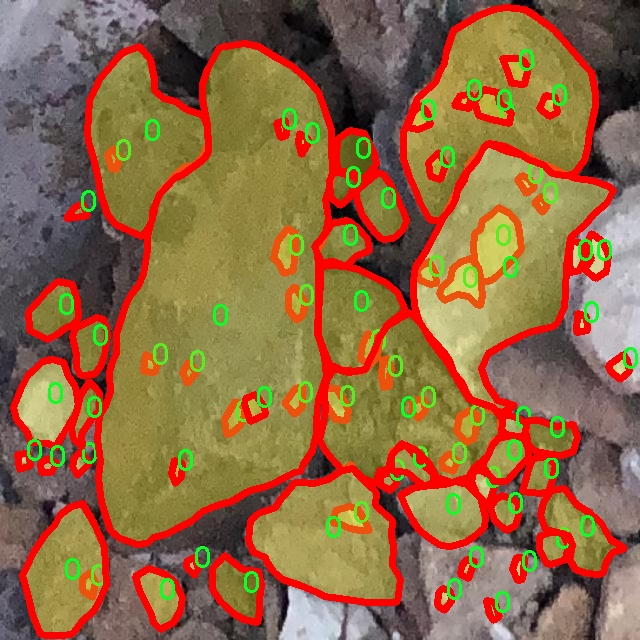

### 1.背景意义

研究背景与意义

随着计算机视觉技术的快速发展，实例分割作为其中一个重要的研究方向，逐渐在多个领域中展现出其独特的应用价值。实例分割不仅能够对图像中的物体进行识别，还能精确地划分出每个物体的轮廓，这在许多实际应用中都具有重要意义。例如，在建筑行业中，石材的识别与分割对于材料的管理、施工进度的监控以及成本控制等方面都起着至关重要的作用。因此，开发一个高效的石材实例分割系统，能够有效提升相关行业的自动化水平和工作效率。

本研究旨在基于改进的YOLOv11模型，构建一个针对石材的实例分割系统。YOLO（You Only Look Once）系列模型以其快速的检测速度和良好的准确性而闻名，然而，针对特定应用场景的改进仍然是提升模型性能的关键。本项目将利用1300张石材图像的数据集，进行模型的训练与优化。该数据集的单一类别特性，虽然在某种程度上限制了模型的泛化能力，但也为专注于石材实例分割提供了良好的基础。

通过对YOLOv11模型的改进，我们期望在石材实例分割的精度和速度上实现显著提升。具体而言，改进将集中在特征提取网络的优化、损失函数的调整以及后处理策略的创新等方面。这些改进不仅有助于提高模型在石材分割任务中的表现，还将为其他相似的实例分割任务提供参考。

综上所述，基于改进YOLOv11的石材实例分割系统的研究，不仅能够推动计算机视觉技术在建筑材料管理中的应用，还将为相关领域的智能化发展提供有力支持。通过本项目的实施，我们期望为行业提供一种高效、准确的解决方案，助力于实现更高水平的自动化与智能化。

### 2.视频效果

[2.1 视频效果](https://www.bilibili.com/video/BV1SZkQYVEhu/)

### 3.图片效果


##### [项目涉及的源码数据来源链接](https://kdocs.cn/l/cszuIiCKVNis)**

注意：本项目提供训练的数据集和训练教程,由于版本持续更新,暂不提供权重文件（best.pt）,请按照6.训练教程进行训练后实现上图演示的效果。

### 4.数据集信息

##### 4.1 本项目数据集类别数＆类别名

nc: 1
names: ['0']


该项目为【图像分割】数据集，请在【训练教程和Web端加载模型教程（第三步）】这一步的时候按照【图像分割】部分的教程来训练

##### 4.2 本项目数据集信息介绍

本项目数据集信息介绍

本项目所使用的数据集专注于“stone”这一主题，旨在为改进YOLOv11的石材实例分割系统提供高质量的训练数据。该数据集的设计充分考虑了石材的多样性和复杂性，涵盖了不同类型、形状和纹理的石材实例，以确保模型在实际应用中的鲁棒性和准确性。数据集中包含的类别数量为1，具体类别标记为“0”，这意味着所有的石材实例均被归入同一类别，便于模型专注于学习石材的特征而不被其他类别的干扰所影响。

为了构建这个数据集，我们从多个来源收集了大量的石材图像，确保样本的多样性和代表性。这些图像包括不同光照条件下的石材、不同角度拍摄的石材，以及不同背景下的石材实例。这种多样化的样本选择有助于提高模型的泛化能力，使其能够在各种环境中有效识别和分割石材。

在数据标注方面，我们采用了精细的实例分割标注技术，为每一张图像中的石材实例提供了准确的边界框和掩膜。这种高质量的标注不仅提升了数据集的价值，也为模型的训练提供了可靠的基础。通过使用这一数据集，我们期望能够显著提升YOLOv11在石材实例分割任务中的性能，使其在实际应用中能够更准确地识别和处理石材对象，从而推动相关领域的技术进步和应用拓展。




### 5.全套项目环境部署视频教程（零基础手把手教学）

[5.1 所需软件PyCharm和Anaconda安装教程（第一步）](https://www.bilibili.com/video/BV1BoC1YCEKi/?spm_id_from=333.999.0.0&vd_source=bc9aec86d164b67a7004b996143742dc)


[5.2 安装Python虚拟环境创建和依赖库安装视频教程（第二步）](https://www.bilibili.com/video/BV1ZoC1YCEBw?spm_id_from=333.788.videopod.sections&vd_source=bc9aec86d164b67a7004b996143742dc)

### 6.改进YOLOv11训练教程和Web_UI前端加载模型教程（零基础手把手教学）

[6.1 改进YOLOv11训练教程和Web_UI前端加载模型教程（第三步）](https://www.bilibili.com/video/BV1BoC1YCEhR?spm_id_from=333.788.videopod.sections&vd_source=bc9aec86d164b67a7004b996143742dc)


按照上面的训练视频教程链接加载项目提供的数据集，运行train.py即可开始训练



     Epoch   gpu_mem       box       obj       cls    labels  img_size
     1/200     20.8G   0.01576   0.01955  0.007536        22      1280: 100%|██████████| 849/849 [14:42<00:00,  1.04s/it]
               Class     Images     Labels          P          R     mAP@.5 mAP@.5:.95: 100%|██████████| 213/213 [01:14<00:00,  2.87it/s]
                 all       3395      17314      0.994      0.957      0.0957      0.0843

     Epoch   gpu_mem       box       obj       cls    labels  img_size
     2/200     20.8G   0.01578   0.01923  0.007006        22      1280: 100%|██████████| 849/849 [14:44<00:00,  1.04s/it]
               Class     Images     Labels          P          R     mAP@.5 mAP@.5:.95: 100%|██████████| 213/213 [01:12<00:00,  2.95it/s]
                 all       3395      17314      0.996      0.956      0.0957      0.0845

     Epoch   gpu_mem       box       obj       cls    labels  img_size
     3/200     20.8G   0.01561    0.0191  0.006895        27      1280: 100%|██████████| 849/849 [10:56<00:00,  1.29it/s]
               Class     Images     Labels          P          R     mAP@.5 mAP@.5:.95: 100%|███████   | 187/213 [00:52<00:00,  4.04it/s]
                 all       3395      17314      0.996      0.957      0.0957      0.0845


###### [项目数据集下载链接](https://kdocs.cn/l/cszuIiCKVNis)

### 7.原始YOLOv11算法讲解

YOLO11采用改进的骨干和颈部架构，增强了特征提取能力，提高了物体检测的精确度和复杂任务的表现。YOLO11引入精炼的架构设计和优化的训练流程，实现更快的处理速度，同时保持精度和性能之间的最佳平衡。通过模型设计的进步，YOLO11m在COCO数据集上实现了更高的均值平均精度（mAP），同时使用比YOLOv8m少22%的参数，使其在不妥协准确性的情况下更加计算高效。YOLO11可以无缝部署在各种环境中，包括边缘设备、云平台以及支持NVIDIA
GPU的系统，确保最大灵活性。无论是物体检测、实例分割、图像分类、姿态估计，还是定向物体检测（OBB），YOLO11都旨在应对多样的计算机视觉挑战。


##### **Ultralytics YOLO11相比于之前版本的主要改进有哪些？**

Ultralytics YOLO11在其前身基础上引入了几项重要进步。主要改进包括：

  1. **增强的特征提取** ：YOLO11采用改进的骨干和颈部架构，增强了特征提取能力，提高了物体检测的精确度。
  2.  **优化的效率和速度** ：精炼的架构设计和优化的训练流程实现了更快的处理速度，同时保持了准确性和性能之间的平衡。
  3.  **更高的准确性与更少的参数** ：YOLO11m在COCO数据集上实现了更高的均值平均精度（mAP），同时使用比YOLOv8m少22%的参数，使其在不妥协准确性的情况下更加计算高效。
  4.  **环境适应性强** ：YOLO11可以在多种环境中部署，包括边缘设备、云平台以及支持NVIDIA GPU的系统。
  5.  **支持广泛的任务** ：YOLO11支持多种计算机视觉任务，如物体检测、实例分割、图像分类、姿态估计和定向物体检测（OBB）。

我们先来看一下其网络结构有什么变化，可以看出，相比较于YOLOv8模型，其将CF2模块改成C3K2，同时在SPPF模块后面添加了一个C2PSA模块，且将YOLOv10的head思想引入到YOLO11的head中，使用深度可分离的方法，减少冗余计算，提高效率。下面我们来详细看一下这两个模块的结构是怎么构成的，以及它们为什么要这样设计


##### C3K2的网络结构

从下面图中我们可以看到，C3K2模块其实就是C2F模块转变出来的，它代码中有一个设置，就是当c3k这个参数为FALSE的时候，C3K2模块就是C2F模块，也就是说它的Bottleneck是普通的Bottleneck；反之当它为true的时候，将Bottleneck模块替换成C3模块。


##### C2PSA的网络结构

` `C2PSA是对 `C2f` 模块的扩展，它结合了PSA(Pointwise Spatial
Attention)块，用于增强特征提取和注意力机制。通过在标准 `C2f` 模块中引入 PSA
块，C2PSA实现了更强大的注意力机制，从而提高了模型对重要特征的捕捉能力。


##### **C2f 模块回顾：**

**** C2f模块是一个更快的 CSP（Cross Stage Partial）瓶颈实现，它通过两个卷积层和多个 Bottleneck
块进行特征提取。相比传统的 CSPNet，C2f 优化了瓶颈层的结构，使得计算速度更快。在 C2f中，`cv1` 是第一个 1x1
卷积，用于减少通道数；`cv2` 是另一个 1x1 卷积，用于恢复输出通道数。而 `n` 是一个包含 Bottleneck 块的数量，用于提取特征。

##### **C2PSA 模块的增强** ：

**C2PSA** 扩展了 C2f，通过引入PSA( **Position-Sensitive Attention)**
，旨在通过多头注意力机制和前馈神经网络来增强特征提取能力。它可以选择性地添加残差结构（shortcut）以优化梯度传播和网络训练效果。同时，使用FFN
可以将输入特征映射到更高维的空间，捕获输入特征的复杂非线性关系，允许模型学习更丰富的特征表示。

##### head部分

YOLO11在head部分的cls分支上使用深度可分离卷积 ，具体代码如下，cv2边界框回归分支，cv3分类分支。

    
    
     self.cv2 = nn.ModuleList(
                nn.Sequential(Conv(x, c2, 3), Conv(c2, c2, 3), nn.Conv2d(c2, 4 * self.reg_max, 1)) for x in ch
            )
            self.cv3 = nn.ModuleList(
                nn.Sequential(
                    nn.Sequential(DWConv(x, x, 3), Conv(x, c3, 1)),
                    nn.Sequential(DWConv(c3, c3, 3), Conv(c3, c3, 1)),
                    nn.Conv2d(c3, self.nc, 1),
                )
                for x in ch
            )


### 8.200+种全套改进YOLOV11创新点原理讲解

#### 8.1 200+种全套改进YOLOV11创新点原理讲解大全

由于篇幅限制，每个创新点的具体原理讲解就不全部展开，具体见下列网址中的改进模块对应项目的技术原理博客网址【Blog】（创新点均为模块化搭建，原理适配YOLOv5~YOLOv11等各种版本）

[改进模块技术原理博客【Blog】网址链接](https://gitee.com/qunmasj/good)


#### 8.2 精选部分改进YOLOV11创新点原理讲解

###### 这里节选部分改进创新点展开原理讲解(完整的改进原理见上图和[改进模块技术原理博客链接](https://gitee.com/qunmasj/good)【如果此小节的图加载失败可以通过CSDN或者Github搜索该博客的标题访问原始博客，原始博客图片显示正常】
### 全维动态卷积ODConv
鉴于上述讨论，我们的ODConv引入了一种多维注意机制，该机制具有并行策略，用于学习卷积核在核空间的所有四个维度上的不同注意。图提供了CondConv、DyConv和ODConv的示意性比较。

ODConv的公式：根据等式1中的符号，ODConv可定义为


 将注意力标量分配给整个卷积核。图2示出了将这四种类型的关注乘以n个卷积核的过程。原则上，这四种类型的关注是相互补充的，并且以位置、信道、滤波器和核的顺序将它们逐步乘以卷积核 
 ，使得卷积运算不同w.r.t.所有空间位置、所有输入信道、所有滤波器和输入x的所有核，提供捕获丰富上下文线索的性能保证。因此，ODConv可以显著增强CNN基本卷积运算的特征提取能力。此外，具有单个卷积核的ODConv可以与标准CondConv和DyConv竞争或优于它们，为最终模型引入的额外参数大大减少。提供了大量实验来验证这些优点。通过比较等式1和等式2，我们可以清楚地看到，ODConv是一种更广义的动态卷积。此外，当设置n=1且 所有分量均为1时，只关注滤波器方向 的ODConv将减少为：将基于输入特征的SE变量应用于卷积滤波器，然后进行卷积运算（注意原始SE（Hu等人，2018b）基于输出特征，并且用于重新校准输出特征本身）。这种SE变体是ODConv的特例。


图：将ODConv中的四种注意类型逐步乘以卷积核的示例。（a） 沿空间维度的逐位置乘法运算，（b）沿输入信道维度的逐信道乘法运算、（c）沿输出信道维度的按滤波器乘法运算，以及（d）沿卷积核空间的核维度的按核乘法运算。方法部分对符号进行了说明
实现：对于ODConv，一个关键问题是如何计算卷积核的四种关注度 。继CondConv和DyConv之后，我们还使用SE型注意力模块（Hu等人，2018b），但将多个头部作为来计算它们，其结构如图所示。具体而言，首先通过逐通道全局平均池（GAP）运算将输入压缩到具有长度的特征向量中。随后，存在完全连接（FC）层和四个头部分支。ReLU（Krizhevsky等人，2012）位于FC层之后。FC层将压缩特征向量映射到具有缩减比的低维空间（根据消融实验，我们在所有主要实验中设置 ，避免了高模型复杂度）。对于四个头部分支，每个分支都有一个输出大小如图。

### 引入ODConv的改进YOLO
参考这篇博客涵盖了引入ODConv的改进YOLOv11系统的内容，ODConv采用多维注意机制，在卷积核空间的四个维度上学习不同的注意。结合了CondConv和DyConv的优势，ODConv通过图示的四种注意类型逐步与卷积核相乘，以捕获丰富的上下文线索，提升特征提取能力。

#### ODConv结构与方法
ODConv的公式和图示展示了其关注力分配给卷积核的方式，其中四种类型的关注以位置、信道、滤波器和核的顺序逐步与卷积核相乘。这种结构保证了卷积运算不同于标准的Conv操作，能够捕获更多上下文信息，从而增强了CNN的特征提取能力。另外，单个卷积核的ODConv在性能上能够与CondConv和DyConv相竞争，并且引入的额外参数大幅减少。

ODConv的特殊之处在于其广义的动态卷积性质，同时在特定条件下（n=1且所有分量为1），它可以退化为一种特例，即只关注滤波器方向，这类似于基于输入特征的SE变体，但不同于原始SE，它基于输出特征。

#### ODConv的实现
关键问题在于如何计算卷积核的四种关注度。ODConv采用了SE型注意力模块，结合了多个头部来计算这些关注度。具体实现上，通过逐通道全局平均池运算和完全连接层，将输入压缩为特征向量，随后使用四个头部分支来计算四种不同类型的关注。这样的结构能在保持模型复杂度可控的情况下，提升了特征的表征能力。

ODConv的引入为YOLOv11带来了显著的性能提升，并且通过大量实验证明了其在特征提取方面的优越性。其结合了多维注意机制和卷积操作，为目标检测和分拣系统的提升带来了新的思路和性能突破。


### 9.系统功能展示

图9.1.系统支持检测结果表格显示

  图9.2.系统支持置信度和IOU阈值手动调节

  图9.3.系统支持自定义加载权重文件best.pt(需要你通过步骤5中训练获得)

  图9.4.系统支持摄像头实时识别

  图9.5.系统支持图片识别

  图9.6.系统支持视频识别

  图9.7.系统支持识别结果文件自动保存

  图9.8.系统支持Excel导出检测结果数据


### 10. YOLOv11核心改进源码讲解

#### 10.1 CTrans.py

以下是对给定代码的核心部分进行分析和注释的结果。代码主要实现了一个通道变换器（Channel Transformer），用于处理图像数据。核心部分包括通道嵌入、重构、注意力机制、前馈网络和编码器等模块。

```python
# -*- coding: utf-8 -*-
import torch
import torch.nn as nn
import numpy as np
from torch.nn import Dropout, Softmax, Conv2d, LayerNorm

class Channel_Embeddings(nn.Module):
    """通道嵌入类，负责将输入图像分割成补丁并添加位置嵌入。"""
    def __init__(self, patchsize, img_size, in_channels):
        super().__init__()
        img_size = (img_size, img_size)  # 将图像大小转换为元组
        patch_size = (patchsize, patchsize)  # 将补丁大小转换为元组
        n_patches = (img_size[0] // patch_size[0]) * (img_size[1] // patch_size[1])  # 计算补丁数量

        # 定义补丁嵌入层
        self.patch_embeddings = nn.Sequential(
            nn.MaxPool2d(kernel_size=5, stride=5),  # 最大池化层
            Conv2d(in_channels=in_channels,
                    out_channels=in_channels,
                    kernel_size=patchsize // 5,
                    stride=patchsize // 5)  # 卷积层
        )

        # 定义位置嵌入
        self.position_embeddings = nn.Parameter(torch.zeros(1, n_patches, in_channels))
        self.dropout = Dropout(0.1)  # Dropout层

    def forward(self, x):
        """前向传播函数，计算嵌入。"""
        if x is None:
            return None
        x = self.patch_embeddings(x)  # 通过补丁嵌入层
        x = x.flatten(2)  # 展平
        x = x.transpose(-1, -2)  # 转置
        embeddings = x + self.position_embeddings  # 添加位置嵌入
        embeddings = self.dropout(embeddings)  # 应用Dropout
        return embeddings

class Attention_org(nn.Module):
    """自定义注意力机制类。"""
    def __init__(self, vis, channel_num):
        super(Attention_org, self).__init__()
        self.vis = vis
        self.KV_size = sum(channel_num)  # 计算键值大小
        self.channel_num = channel_num
        self.num_attention_heads = 4  # 注意力头数量

        # 定义查询、键、值的线性变换
        self.query = nn.ModuleList([nn.Linear(c, c, bias=False) for c in channel_num])
        self.key = nn.Linear(self.KV_size, self.KV_size, bias=False)
        self.value = nn.Linear(self.KV_size, self.KV_size, bias=False)
        self.softmax = Softmax(dim=3)  # Softmax层
        self.attn_dropout = Dropout(0.1)  # Dropout层

    def forward(self, *embeddings):
        """前向传播函数，计算注意力输出。"""
        multi_head_Q = [query(emb) for query, emb in zip(self.query, embeddings) if emb is not None]
        multi_head_K = self.key(torch.cat(embeddings, dim=2))  # 连接所有嵌入
        multi_head_V = self.value(torch.cat(embeddings, dim=2))

        # 计算注意力分数
        attention_scores = [torch.matmul(Q, multi_head_K) / np.sqrt(self.KV_size) for Q in multi_head_Q]
        attention_probs = [self.softmax(score) for score in attention_scores]

        # 应用Dropout
        attention_probs = [self.attn_dropout(prob) for prob in attention_probs]

        # 计算上下文层
        context_layers = [torch.matmul(prob, multi_head_V) for prob in attention_probs]
        return context_layers

class Mlp(nn.Module):
    """前馈网络类。"""
    def __init__(self, in_channel, mlp_channel):
        super(Mlp, self).__init__()
        self.fc1 = nn.Linear(in_channel, mlp_channel)  # 第一层线性变换
        self.fc2 = nn.Linear(mlp_channel, in_channel)  # 第二层线性变换
        self.act_fn = nn.GELU()  # 激活函数
        self.dropout = Dropout(0.0)  # Dropout层

    def forward(self, x):
        """前向传播函数。"""
        x = self.fc1(x)  # 线性变换
        x = self.act_fn(x)  # 激活
        x = self.dropout(x)  # 应用Dropout
        x = self.fc2(x)  # 线性变换
        return x

class Block_ViT(nn.Module):
    """ViT块，包含注意力和前馈网络。"""
    def __init__(self, vis, channel_num):
        super(Block_ViT, self).__init__()
        self.attn_norm = LayerNorm(sum(channel_num), eps=1e-6)  # 归一化层
        self.channel_attn = Attention_org(vis, channel_num)  # 注意力机制
        self.ffn = Mlp(channel_num[0], channel_num[0] * 4)  # 前馈网络

    def forward(self, *embeddings):
        """前向传播函数。"""
        emb_all = torch.cat(embeddings, dim=2)  # 连接所有嵌入
        emb_all = self.attn_norm(emb_all)  # 归一化
        context_layers = self.channel_attn(*embeddings)  # 计算上下文层
        return [emb + context for emb, context in zip(embeddings, context_layers)]  # 残差连接

class Encoder(nn.Module):
    """编码器类，包含多个ViT块。"""
    def __init__(self, vis, channel_num):
        super(Encoder, self).__init__()
        self.layer = nn.ModuleList([Block_ViT(vis, channel_num) for _ in range(1)])  # 定义多个块

    def forward(self, *embeddings):
        """前向传播函数。"""
        for layer_block in self.layer:
            embeddings = layer_block(*embeddings)  # 通过每个块
        return embeddings  # 返回最终嵌入

class ChannelTransformer(nn.Module):
    """通道变换器类，整体架构。"""
    def __init__(self, channel_num=[64, 128, 256, 512], img_size=640, vis=False, patchSize=[40, 20, 10, 5]):
        super().__init__()
        self.embeddings = nn.ModuleList([Channel_Embeddings(patchSize[i], img_size // (2 ** (i + 2)), channel_num[i]) for i in range(len(channel_num))])
        self.encoder = Encoder(vis, channel_num)  # 编码器
        self.reconstruct = nn.ModuleList([Reconstruct(channel_num[i], channel_num[i], kernel_size=1, scale_factor=(patchSize[i], patchSize[i])) for i in range(len(channel_num))])  # 重构层

    def forward(self, en):
        """前向传播函数。"""
        embeddings = [emb(en[i]) for i, emb in enumerate(self.embeddings) if en[i] is not None]  # 计算嵌入
        encoded = self.encoder(*embeddings)  # 编码
        return [self.reconstruct[i](encoded[i]) + en[i] for i in range(len(encoded))]  # 重构并加上残差

class GetIndexOutput(nn.Module):
    """获取特定索引输出的类。"""
    def __init__(self, index):
        super().__init__()
        self.index = index

    def forward(self, x):
        """前向传播函数，返回特定索引的输出。"""
        return x[self.index]
```

### 代码核心部分说明：
1. **Channel_Embeddings**: 负责将输入图像转换为补丁并添加位置嵌入。
2. **Attention_org**: 实现了多头自注意力机制，计算输入嵌入之间的注意力分数。
3. **Mlp**: 定义了一个简单的前馈神经网络，包含两个线性层和激活函数。
4. **Block_ViT**: 结合注意力机制和前馈网络，形成一个ViT块。
5. **Encoder**: 由多个ViT块组成的编码器，处理输入的嵌入。
6. **ChannelTransformer**: 整体架构，包含嵌入、编码和重构过程。
7. **GetIndexOutput**: 提供从输出中获取特定索引的功能。

以上是对代码的核心部分进行了提炼和详细注释，旨在帮助理解其结构和功能。

这个文件 `CTrans.py` 实现了一个名为 `ChannelTransformer` 的深度学习模型，主要用于图像处理任务。该模型的结构基于 Transformer 架构，特别是针对图像的通道特征进行处理。以下是对代码的逐步分析和说明。

首先，文件引入了一些必要的库，包括 PyTorch 和 NumPy，这些库为模型的构建和训练提供了基础支持。接着，定义了几个重要的类。

`Channel_Embeddings` 类用于构建图像的嵌入表示。它通过最大池化和卷积操作将输入图像划分为多个小块（patch），并为每个小块生成位置嵌入。位置嵌入是一个可学习的参数，能够帮助模型理解图像中不同位置的特征。最后，使用 Dropout 技术来防止过拟合。

`Reconstruct` 类则负责将经过编码的特征重新构建为图像的形式。它通过卷积层和上采样操作将特征图的尺寸恢复到原始图像的大小，并应用批归一化和激活函数以增强模型的非线性表达能力。

`Attention_org` 类实现了多头自注意力机制，允许模型在不同的通道上并行地学习特征。它通过线性变换生成查询（Q）、键（K）和值（V），并计算注意力分数。然后，使用 Softmax 函数计算注意力权重，并将其应用于值（V）以生成上下文层。这个过程允许模型关注输入特征的不同部分，从而增强特征表示的能力。

`Mlp` 类定义了一个简单的多层感知机（MLP），用于特征的进一步处理。它包含两个全连接层和一个激活函数（GELU），并使用 Xavier 初始化方法来初始化权重。

`Block_ViT` 类是一个 Transformer 的基本构建块，结合了自注意力机制和前馈网络。它首先对输入的特征进行层归一化，然后通过自注意力模块进行特征增强，最后通过 MLP 进行非线性变换。

`Encoder` 类由多个 `Block_ViT` 组成，负责对输入特征进行多层次的编码。它对每个通道的特征进行处理，并在每一层之后应用层归一化。

`ChannelTransformer` 类是整个模型的核心，负责将输入图像分成多个通道，并为每个通道构建嵌入。它使用 `Encoder` 对嵌入进行编码，并通过 `Reconstruct` 类将编码后的特征重建为图像。这个类还支持可视化功能，可以输出注意力权重。

最后，`GetIndexOutput` 类是一个简单的模块，用于从模型的输出中提取特定索引的结果。

整体来看，这个文件实现了一个复杂的图像处理模型，结合了卷积神经网络和 Transformer 的优点，能够有效地处理图像数据并提取多层次的特征。模型的设计考虑了通道特征的多样性和位置的上下文信息，使其在图像分析任务中具有良好的表现。

#### 10.2 SwinTransformer.py

以下是经过简化并附有详细中文注释的核心代码部分：

```python
import torch
import torch.nn as nn
import torch.nn.functional as F
import numpy as np

class Mlp(nn.Module):
    """ 多层感知机（MLP）模块。"""

    def __init__(self, in_features, hidden_features=None, out_features=None, act_layer=nn.GELU, drop=0.):
        super().__init__()
        out_features = out_features or in_features  # 输出特征数
        hidden_features = hidden_features or in_features  # 隐藏层特征数
        self.fc1 = nn.Linear(in_features, hidden_features)  # 第一层线性变换
        self.act = act_layer()  # 激活函数
        self.fc2 = nn.Linear(hidden_features, out_features)  # 第二层线性变换
        self.drop = nn.Dropout(drop)  # Dropout层

    def forward(self, x):
        """ 前向传播函数。"""
        x = self.fc1(x)  # 线性变换
        x = self.act(x)  # 激活
        x = self.drop(x)  # Dropout
        x = self.fc2(x)  # 线性变换
        x = self.drop(x)  # Dropout
        return x


class WindowAttention(nn.Module):
    """ 基于窗口的多头自注意力模块。"""

    def __init__(self, dim, window_size, num_heads, qkv_bias=True, attn_drop=0., proj_drop=0.):
        super().__init__()
        self.dim = dim  # 输入通道数
        self.window_size = window_size  # 窗口大小
        self.num_heads = num_heads  # 注意力头数
        head_dim = dim // num_heads  # 每个头的维度
        self.scale = head_dim ** -0.5  # 缩放因子

        # 定义相对位置偏置参数
        self.relative_position_bias_table = nn.Parameter(
            torch.zeros((2 * window_size[0] - 1) * (2 * window_size[1] - 1), num_heads))

        # 计算相对位置索引
        coords_h = torch.arange(self.window_size[0])
        coords_w = torch.arange(self.window_size[1])
        coords = torch.stack(torch.meshgrid([coords_h, coords_w]))  # 生成坐标网格
        coords_flatten = torch.flatten(coords, 1)  # 展平坐标
        relative_coords = coords_flatten[:, :, None] - coords_flatten[:, None, :]  # 计算相对坐标
        relative_coords = relative_coords.permute(1, 2, 0).contiguous()  # 重新排列维度
        relative_coords[:, :, 0] += self.window_size[0] - 1  # 归一化
        relative_coords[:, :, 1] += self.window_size[1] - 1
        relative_coords[:, :, 0] *= 2 * self.window_size[1] - 1
        relative_position_index = relative_coords.sum(-1)  # 计算相对位置索引
        self.register_buffer("relative_position_index", relative_position_index)  # 注册为缓冲区

        self.qkv = nn.Linear(dim, dim * 3, bias=qkv_bias)  # QKV线性变换
        self.attn_drop = nn.Dropout(attn_drop)  # 注意力Dropout
        self.proj = nn.Linear(dim, dim)  # 输出线性变换
        self.proj_drop = nn.Dropout(proj_drop)  # 输出Dropout
        self.softmax = nn.Softmax(dim=-1)  # Softmax层

    def forward(self, x, mask=None):
        """ 前向传播函数。"""
        B_, N, C = x.shape  # B: 批量大小, N: 序列长度, C: 通道数
        qkv = self.qkv(x).reshape(B_, N, 3, self.num_heads, C // self.num_heads).permute(2, 0, 3, 1, 4)
        q, k, v = qkv[0], qkv[1], qkv[2]  # 分离Q, K, V

        q = q * self.scale  # 缩放Q
        attn = (q @ k.transpose(-2, -1))  # 计算注意力分数

        # 添加相对位置偏置
        relative_position_bias = self.relative_position_bias_table[self.relative_position_index.view(-1)].view(
            self.window_size[0] * self.window_size[1], self.window_size[0] * self.window_size[1], -1)
        relative_position_bias = relative_position_bias.permute(2, 0, 1).contiguous()  # 重新排列
        attn = attn + relative_position_bias.unsqueeze(0)  # 加入偏置

        attn = self.softmax(attn)  # 归一化
        attn = self.attn_drop(attn)  # Dropout

        x = (attn @ v).transpose(1, 2).reshape(B_, N, C)  # 计算输出
        x = self.proj(x)  # 输出线性变换
        x = self.proj_drop(x)  # Dropout
        return x


class SwinTransformer(nn.Module):
    """ Swin Transformer主干网络。"""

    def __init__(self, patch_size=4, embed_dim=96, depths=[2, 2, 6, 2], num_heads=[3, 6, 12, 24]):
        super().__init__()
        self.patch_embed = PatchEmbed(patch_size=patch_size, in_chans=3, embed_dim=embed_dim)  # 图像分块嵌入
        self.layers = nn.ModuleList()  # 存储各层

        # 构建每一层
        for i_layer in range(len(depths)):
            layer = BasicLayer(
                dim=int(embed_dim * 2 ** i_layer),
                depth=depths[i_layer],
                num_heads=num_heads[i_layer],
                window_size=7)  # 窗口大小
            self.layers.append(layer)

    def forward(self, x):
        """ 前向传播函数。"""
        x = self.patch_embed(x)  # 图像分块嵌入
        for layer in self.layers:
            x = layer(x)  # 逐层前向传播
        return x  # 返回最终输出


def SwinTransformer_Tiny(weights=''):
    """ 创建Swin Transformer Tiny模型。"""
    model = SwinTransformer(depths=[2, 2, 6, 2], num_heads=[3, 6, 12, 24])  # 创建模型
    if weights:
        model.load_state_dict(torch.load(weights)['model'])  # 加载权重
    return model
```

### 代码说明：
1. **Mlp类**：实现了一个简单的多层感知机，包含两个线性层和一个激活函数，支持Dropout。
2. **WindowAttention类**：实现了窗口自注意力机制，计算Q、K、V并加入相对位置偏置。
3. **SwinTransformer类**：构建了Swin Transformer的主干网络，包含图像分块嵌入和多个Transformer层。
4. **SwinTransformer_Tiny函数**：用于创建一个小型的Swin Transformer模型，并可选择加载预训练权重。

此代码为Swin Transformer的核心部分，包含了主要的结构和计算逻辑。

这个程序文件实现了Swin Transformer模型，主要用于计算机视觉任务。Swin Transformer是一种层次化的视觉Transformer，采用了窗口注意力机制，通过分块处理图像来提高计算效率。以下是对代码的详细说明。

首先，导入了必要的库，包括PyTorch和一些辅助函数。接着定义了一个多层感知机（Mlp）类，它包含两个全连接层和一个激活函数（默认为GELU），并在每个层之间使用了Dropout以防止过拟合。

接下来，定义了窗口分割和窗口逆转的函数。`window_partition`函数将输入特征图分割成多个窗口，而`window_reverse`函数则将这些窗口合并回原来的特征图。这种窗口操作是Swin Transformer的核心思想之一。

然后，定义了`WindowAttention`类，这是窗口基础的多头自注意力模块。它支持相对位置偏置，并可以处理移动窗口（shifted window）和非移动窗口的情况。这个模块通过线性变换生成查询、键和值，并计算注意力权重，最后通过线性变换输出结果。

接着，定义了`SwinTransformerBlock`类，它是Swin Transformer的基本构建块。每个块包含一个窗口注意力层和一个前馈网络（FFN），并使用残差连接和层归一化。该块还支持窗口的循环移动，以便在不同的块之间共享信息。

`PatchMerging`类用于将特征图的块合并，减少空间维度并增加通道数。它通过线性变换实现特征的降维。

`BasicLayer`类表示Swin Transformer中的一个基本层，包含多个Swin Transformer块。它还负责计算SW-MSA的注意力掩码，并在必要时进行下采样。

`PatchEmbed`类用于将输入图像分割成不重叠的块，并通过卷积层将其嵌入到高维空间中。它还可以选择性地对嵌入进行归一化。

`SwinTransformer`类是整个模型的主类，负责构建Swin Transformer的各个层。它支持绝对位置嵌入、随机深度、归一化等功能，并在前向传播中依次通过各个层。

最后，定义了一个`update_weight`函数，用于更新模型的权重，并定义了一个`SwinTransformer_Tiny`函数，用于创建一个小型的Swin Transformer模型实例，并加载预训练权重（如果提供）。

整体来看，这个文件实现了Swin Transformer的完整结构，提供了图像处理所需的各个组件，并通过模块化设计使得模型的构建和使用更加灵活。

#### 10.3 head.py

以下是经过简化和注释的核心代码部分，主要集中在`Detect_DyHead`类及其`forward`方法的实现。这个类是YOLOv8检测模型的一个重要组成部分，负责处理输入特征并生成检测结果。

```python
import torch
import torch.nn as nn
import math

class Detect_DyHead(nn.Module):
    """YOLOv8 检测头，使用动态头（DyHead）进行目标检测。"""
    
    def __init__(self, nc=80, hidc=256, block_num=2, ch=()):
        """
        初始化检测头的参数。
        
        参数:
        nc (int): 类别数量。
        hidc (int): 隐藏层通道数。
        block_num (int): 动态头块的数量。
        ch (tuple): 输入特征图的通道数。
        """
        super().__init__()
        self.nc = nc  # 类别数量
        self.nl = len(ch)  # 检测层的数量
        self.reg_max = 16  # DFL通道数
        self.no = nc + self.reg_max * 4  # 每个锚点的输出数量
        self.stride = torch.zeros(self.nl)  # 在构建过程中计算的步幅
        c2, c3 = max((16, ch[0] // 4, self.reg_max * 4)), max(ch[0], self.nc)  # 通道数
        
        # 定义卷积层
        self.conv = nn.ModuleList(nn.Sequential(Conv(x, hidc, 1)) for x in ch)
        self.dyhead = nn.Sequential(*[DyHeadBlock(hidc) for _ in range(block_num)])  # 动态头块
        self.cv2 = nn.ModuleList(
            nn.Sequential(Conv(hidc, c2, 3), Conv(c2, c2, 3), nn.Conv2d(c2, 4 * self.reg_max, 1)) for _ in ch
        )
        self.cv3 = nn.ModuleList(
            nn.Sequential(
                nn.Sequential(DWConv(hidc, x, 3), Conv(x, c3, 1)),
                nn.Sequential(DWConv(c3, c3, 3), Conv(c3, c3, 1)),
                nn.Conv2d(c3, self.nc, 1),
            )
            for x in ch
        )
        self.dfl = DFL(self.reg_max) if self.reg_max > 1 else nn.Identity()  # DFL层

    def forward(self, x):
        """连接并返回预测的边界框和类别概率。"""
        # 对每个检测层应用卷积
        for i in range(self.nl):
            x[i] = self.conv[i](x[i])
        
        # 通过动态头处理特征
        x = self.dyhead(x)
        shape = x[0].shape  # BCHW
        
        # 将每个检测层的输出连接在一起
        for i in range(self.nl):
            x[i] = torch.cat((self.cv2[i](x[i]), self.cv3[i](x[i])), 1)
        
        # 如果在训练模式下，直接返回
        if self.training:
            return x
        
        # 动态模式或形状变化时，更新锚点和步幅
        self.anchors, self.strides = (x.transpose(0, 1) for x in make_anchors(x, self.stride, 0.5))
        self.shape = shape

        # 将所有输出连接成一个张量
        x_cat = torch.cat([xi.view(shape[0], self.no, -1) for xi in x], 2)
        
        # 分割边界框和类别
        box, cls = x_cat.split((self.reg_max * 4, self.nc), 1)
        
        # 解码边界框
        dbox = dist2bbox(self.dfl(box), self.anchors.unsqueeze(0), xywh=True, dim=1) * self.strides
        
        # 返回最终的输出
        return torch.cat((dbox, cls.sigmoid()), 1)

    def bias_init(self):
        """初始化检测头的偏置，警告：需要步幅可用。"""
        for a, b, s in zip(self.cv2, self.cv3, self.stride):
            a[-1].bias.data[:] = 1.0  # 边界框偏置
            b[-1].bias.data[:self.nc] = math.log(5 / self.nc / (640 / s) ** 2)  # 类别偏置
```

### 代码说明：
1. **类的定义**：`Detect_DyHead`类是YOLOv8模型中的一个检测头，负责处理输入特征并生成检测结果。
2. **初始化方法**：在`__init__`方法中，定义了模型的各个参数，包括类别数量、隐藏层通道数、动态头块的数量等，并构建了必要的卷积层。
3. **前向传播方法**：`forward`方法实现了特征的处理流程，包括卷积操作、动态头的应用、输出的连接和最终的边界框与类别的解码。
4. **偏置初始化**：`bias_init`方法用于初始化模型中的偏置参数，以提高模型的收敛速度和性能。

这个代码片段展示了YOLOv8检测头的核心功能，适合用于目标检测任务。

这个文件 `head.py` 是一个用于 YOLOv8（You Only Look Once 第八版）目标检测模型的实现，主要包含多个检测头的定义。文件中使用了 PyTorch 框架，并引入了一些常用的深度学习模块和函数。以下是对文件内容的详细说明。

首先，文件导入了一些必要的库，包括数学库、深度学习库 PyTorch 及其相关模块。接着，文件定义了多个类，每个类代表一种特定的检测头，负责处理输入特征图并输出目标检测的结果。

`Detect_DyHead` 类是一个动态头部的实现，适用于目标检测模型。它的构造函数初始化了一些参数，包括类别数量、隐藏通道数、块的数量等。该类的 `forward` 方法实现了前向传播，处理输入特征图并返回预测的边界框和类别概率。

接下来的类 `Detect_DyHeadWithDCNV3` 和 `Detect_DyHeadWithDCNV4` 继承自 `Detect_DyHead`，并使用不同的动态头块。这些类提供了不同的网络结构，以适应不同的检测需求。

`Detect_AFPN_P345` 和 `Detect_AFPN_P345_Custom` 类实现了带有自适应特征金字塔网络（AFPN）的检测头。AFPN 通过多层特征融合来提高检测精度。这些类的 `forward` 方法类似于前面的检测头，但使用了 AFPN 结构。

`Detect_Efficient` 类实现了一个高效的检测头，旨在减少计算量并提高速度。它使用了分组卷积和其他技术来优化性能。

`DetectAux` 类实现了一个带有辅助头的检测头，用于同时进行主任务和辅助任务的学习。它在 `forward` 方法中处理主任务和辅助任务的特征图。

`Detect_SEAM` 和 `Detect_MultiSEAM` 类实现了基于 SEAM（Squeeze-and-Excitation Attention Module）和 Multi-SEAM 的检测头。这些模块通过引入注意力机制来增强特征图的表达能力。

`Detect_DyHead_Prune` 类实现了一个经过剪枝的动态头部，旨在减少模型的复杂性和计算量。

`Detect_LSCD` 和 `Detect_LSCSBD` 类实现了轻量级共享卷积检测头，采用共享卷积和分离批归一化的策略来提高效率。

`Detect_LADH` 类实现了一个带有深度可分离卷积的检测头，旨在提高模型的效率和准确性。

`Detect_NMSFree` 类实现了一个无非极大值抑制（NMS）的检测头，适用于需要更高精度的场景。

最后，文件中还定义了一些辅助类和函数，如 `Scale`、`Conv_GN`、`TaskDecomposition` 等，这些类和函数用于实现特定的功能，如可学习的缩放参数、标准卷积层、任务分解等。

整体来看，这个文件是 YOLOv8 模型中检测头的实现，包含了多种不同的检测头结构，以适应不同的应用场景和需求。每个类的设计都考虑到了性能和准确性之间的平衡，使用了现代深度学习技术来提高模型的表现。

#### 10.4 predict.py

以下是代码中最核心的部分，并附上详细的中文注释：

```python
from ultralytics.engine.predictor import BasePredictor
from ultralytics.engine.results import Results
from ultralytics.utils import ops

class DetectionPredictor(BasePredictor):
    """
    DetectionPredictor类，继承自BasePredictor类，用于基于检测模型进行预测。
    """

    def postprocess(self, preds, img, orig_imgs):
        """
        对预测结果进行后处理，并返回Results对象的列表。

        参数:
        preds: 模型的预测结果
        img: 输入图像
        orig_imgs: 原始图像列表或张量

        返回:
        results: 包含处理后结果的Results对象列表
        """
        # 应用非极大值抑制（NMS）来过滤重叠的检测框
        preds = ops.non_max_suppression(
            preds,
            self.args.conf,  # 置信度阈值
            self.args.iou,    # IOU阈值
            agnostic=self.args.agnostic_nms,  # 是否使用类别无关的NMS
            max_det=self.args.max_det,  # 最大检测框数量
            classes=self.args.classes,   # 需要检测的类别
        )

        # 如果输入的原始图像不是列表，说明是一个torch.Tensor，需要转换为numpy数组
        if not isinstance(orig_imgs, list):
            orig_imgs = ops.convert_torch2numpy_batch(orig_imgs)

        results = []  # 存储结果的列表
        for i, pred in enumerate(preds):
            orig_img = orig_imgs[i]  # 获取对应的原始图像
            # 将预测框的坐标缩放到原始图像的尺寸
            pred[:, :4] = ops.scale_boxes(img.shape[2:], pred[:, :4], orig_img.shape)
            img_path = self.batch[0][i]  # 获取图像路径
            # 创建Results对象并添加到结果列表中
            results.append(Results(orig_img, path=img_path, names=self.model.names, boxes=pred))
        
        return results  # 返回处理后的结果列表
```

### 代码说明：
1. **类定义**：`DetectionPredictor` 类继承自 `BasePredictor`，用于处理基于检测模型的预测。
2. **后处理方法**：`postprocess` 方法负责对模型的预测结果进行后处理，包括应用非极大值抑制（NMS）和调整预测框的坐标。
3. **非极大值抑制**：通过 `ops.non_max_suppression` 函数过滤掉重叠的检测框，以提高检测的准确性。
4. **图像转换**：如果原始图像不是列表格式，则将其转换为 NumPy 数组，以便后续处理。
5. **结果存储**：通过循环遍历每个预测结果，调整预测框坐标，并将每个结果存储为 `Results` 对象，最终返回所有结果的列表。

这个程序文件 `predict.py` 是一个用于目标检测的预测模块，基于 Ultralytics YOLO（You Only Look Once）模型。它通过继承 `BasePredictor` 类，扩展了预测功能，主要用于处理目标检测任务。

在文件的开头，导入了必要的模块，包括 `BasePredictor`、`Results` 和一些实用的操作函数 `ops`。这些模块提供了基础的预测功能、结果处理和一些图像操作。

`DetectionPredictor` 类是这个文件的核心，主要负责处理目标检测模型的预测。类中包含一个 `postprocess` 方法，该方法用于对模型的预测结果进行后处理，返回一个 `Results` 对象的列表。

在 `postprocess` 方法中，首先调用 `ops.non_max_suppression` 函数对预测结果进行非极大值抑制（NMS），以去除重复的检测框。这个过程使用了一些参数，如置信度阈值、IOU（Intersection over Union）阈值、是否使用类别无关的 NMS、最大检测框数量以及需要检测的类别。

接下来，方法检查输入的原始图像是否为列表，如果不是，则将其转换为 NumPy 数组格式，以便后续处理。然后，程序会遍历每个预测结果，并对每个预测框进行坐标缩放，以适应原始图像的尺寸。最终，使用 `Results` 类将处理后的结果（包括原始图像、图像路径、模型类别名称和预测框）封装起来，并将所有结果返回。

这个模块的使用示例展示了如何初始化 `DetectionPredictor`，并通过调用 `predict_cli` 方法进行预测。用户可以通过传入模型文件和数据源来执行目标检测任务。整体来看，这个文件提供了一个结构清晰、功能完整的目标检测预测实现。

### 11.完整训练+Web前端界面+200+种全套创新点源码、数据集获取


# [下载链接：https://mbd.pub/o/bread/Z52TkpZu](https://mbd.pub/o/bread/Z52TkpZu)